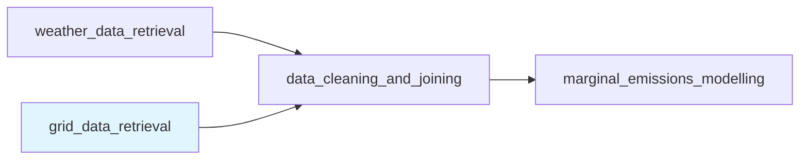

# Grid Data Retrieval

Retrieve electricity grid data from public APIs for marginal emissions factor estimation.

---

## What is Grid Data Retrieval?

The `grid_data_retrieval` module is part of the **Open Source Marginal Emissions (OSME)** framework. It provides programmatic access to electricity grid datasets including:

- **Generation data** - Power output by source (thermal, gas, hydro, nuclear, renewables)
- **Demand data** - Electricity demand and net demand
- **Emissions data** - Carbon intensity and total CO₂ emissions

This module focuses **exclusively on data retrieval**. Data processing (gap-filling, resampling, timezone conversion) is handled by the `data_cleaning_and_joining` module.

---

## Why Grid Data?

Marginal emissions factors (MEFs) estimate the carbon intensity of the **next unit** of electricity generated. To build accurate MEF models, you need:

1. **Weather data** (via `weather_data_retrieval`) - wind, solar, temperature
2. **Grid data** (via `grid_data_retrieval`) - generation, demand, emissions ⬅ **You are here**
3. **Clean, aligned datasets** (via `data_cleaning_and_joining`)
4. **Statistical models** (via `marginal_emissions_modelling`)

Grid data provides the ground truth for training and validating MEF models.

---

## Current Status

**🚧 Under Development**

### Implemented
- ✅ CarbonTracker India API integration
- ✅ Monthly batch downloading
- ✅ File combining and management
- ✅ CLI and JSON config support
- ✅ Structured logging

### Planned
- 🚧 Electricity Maps API
- 🚧 IEA Real-Time Tracker
- 🚧 Additional country-specific sources
- 🚧 Data completeness validation
- 🚧 Gap detection and reporting

---

## Quick Example

### Fetch one year of India grid data

```bash
# Create config
cat > configs/grid/india_2020.json << EOF
{
  "start_date": "2020-01-01 00:00:00",
  "end_date": "2020-12-31 23:55:00"
}
EOF

# Fetch
osme-grid --config configs/grid/india_2020.json --verbose
```

### Output

```
data/grid_data/raw/
├── monthly/                                    # Individual months
│   ├── carbontracker_grid-data_2020_01.parquet
│   ├── carbontracker_grid-data_2020_02.parquet
│   └── ...
└── carbontracker_grid-data_2020-01_2020-12.parquet  # Combined
```

---

## Key Features

### 🔄 Automatic Monthly Batching

The API fetches data in monthly chunks to avoid timeouts and allow incremental downloads. Each month is saved as a separate Parquet file.

### 📦 Optional File Combining

Monthly files can be automatically combined into a single dataset sorted by timestamp. This is useful for analysis but can be disabled if you prefer to work with monthly files.

### ⚙️ Flexible Configuration

Run interactively via CLI arguments or batch via JSON config files. All parameters have sensible defaults.

### 📊 Analysis-Ready Output

Data is saved in Apache Parquet format - efficient, compressed, and compatible with pandas, polars, and DuckDB.

### 🔍 Smart File Management

Skip re-downloading existing months (configurable via `overwrite_existing`). Customize output directories for different projects.

---

## Data Sources

### CarbonTracker India (Implemented)

**Source:** [carbontracker.in](https://carbontracker.in/)  
**Region:** India (national grid)  
**Resolution:** 5-minute intervals  
**Coverage:** 2018-11-21 to present  

**Variables:**
- Generation by source (thermal, gas, hydro, nuclear, renewable)
- Total generation and demand
- Carbon intensity (g CO₂/kWh, tons CO₂/MWh)
- Total emissions (tons CO₂)

**Notes:**
- Data is in UTC timezone
- Free, no API key required
- Maintained by Center for Social and Economic Progress

### Electricity Maps (Planned)

**Source:** [electricitymaps.com](https://www.electricitymaps.com/)  
**Region:** 160+ countries/regions  
**Resolution:** Hourly  

### IEA Real-Time Tracker (Planned)

**Source:** [iea.org](https://www.iea.org/data-and-statistics/data-tools/real-time-electricity-tracker)  
**Region:** 60+ countries  
**Resolution:** Varies by country  

---

## Integration with OSME Workflow



**Typical workflow:**

1. **Fetch weather data** - `osme-weather` retrieves ERA5 reanalysis
2. **Fetch grid data** - `osme-grid` retrieves CarbonTracker data ⬅ **You are here**
3. **Clean and align** - `data_cleaning_and_joining` processes both datasets
4. **Model MEFs** - `marginal_emissions_modelling` trains models

---

## Documentation Structure

- **[Quickstart](quickstart.md)** - Installation and first run
- **[Codebase Reference](codebase.md)** - Module architecture and API
- **[README](../README.md)** - Package overview (detailed)

---

## Getting Help

- **Documentation:** [https://danielkaupa.github.io/open-source-marginal-emissions/](https://danielkaupa.github.io/open-source-marginal-emissions/)
- **Issues:** [GitHub Issues](https://github.com/danielkaupa/open-source-marginal-emissions/issues)
- **Email:** daniel.kaupa@outlook.com

---

## Next Steps

1. **[Install and run](quickstart.md)** your first grid data fetch
2. **Review the [codebase](codebase.md)** to understand module structure
3. **Explore** the [main OSME documentation](../../) for the full workflow

---

**Part of the Open Source Marginal Emissions (OSME) project**  
Licensed under AGPL-3.0-or-later | Commercial licensing available
